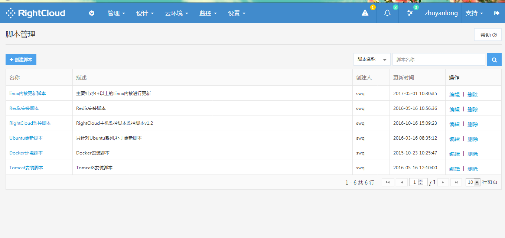
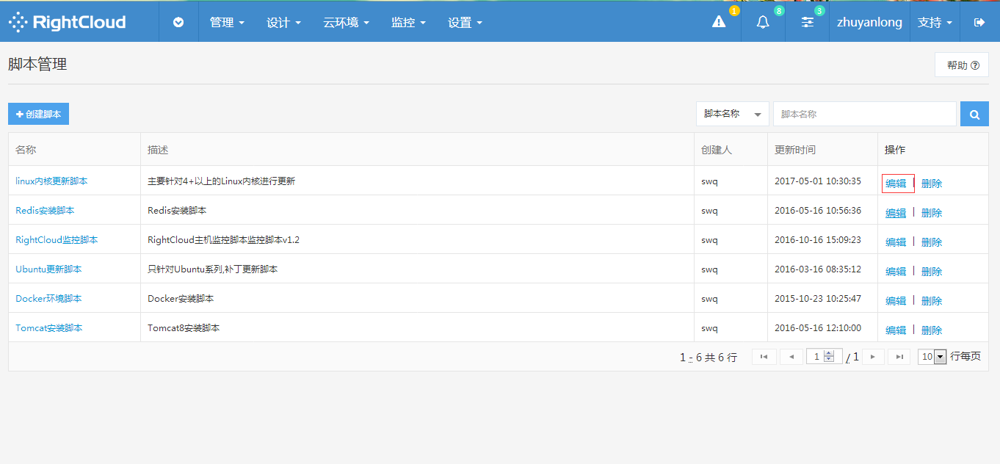
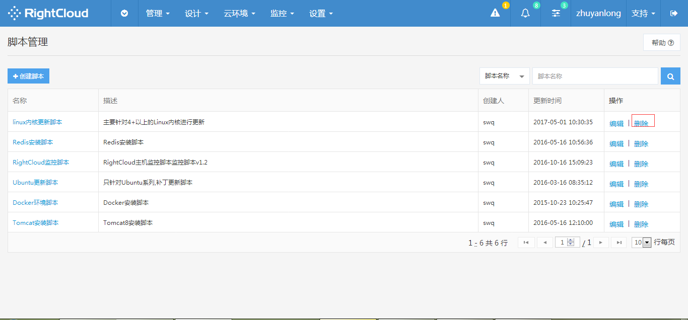
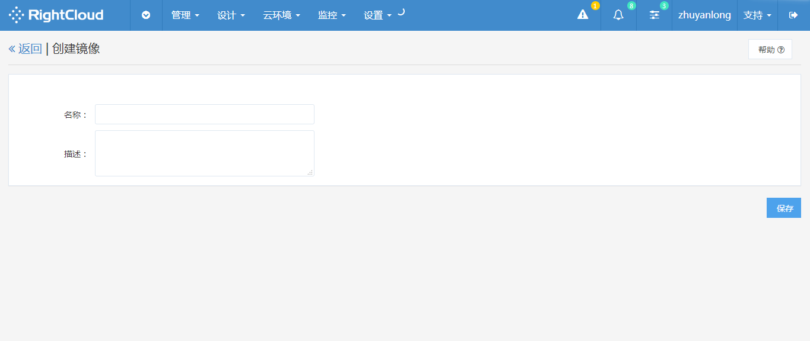
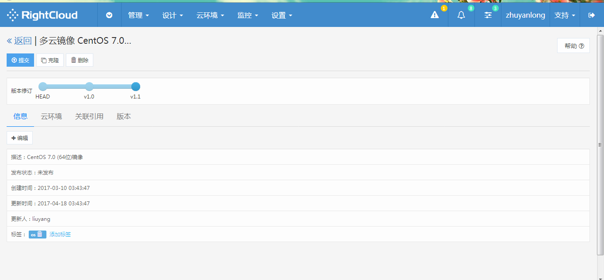
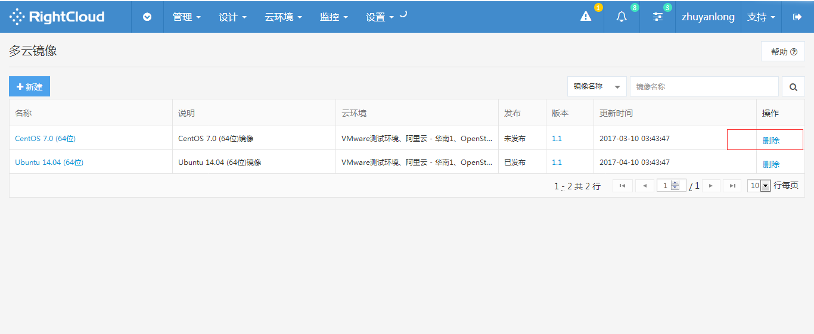
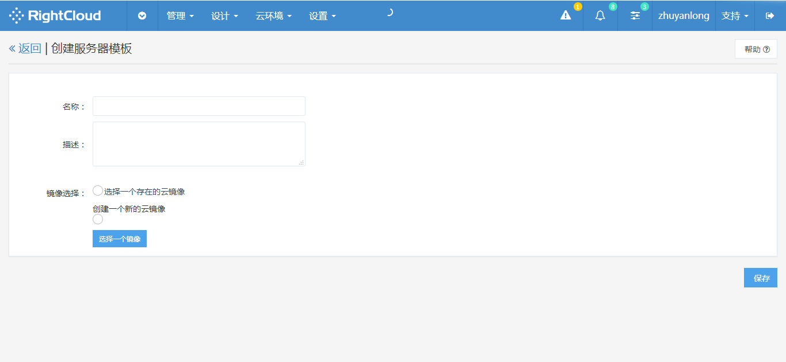
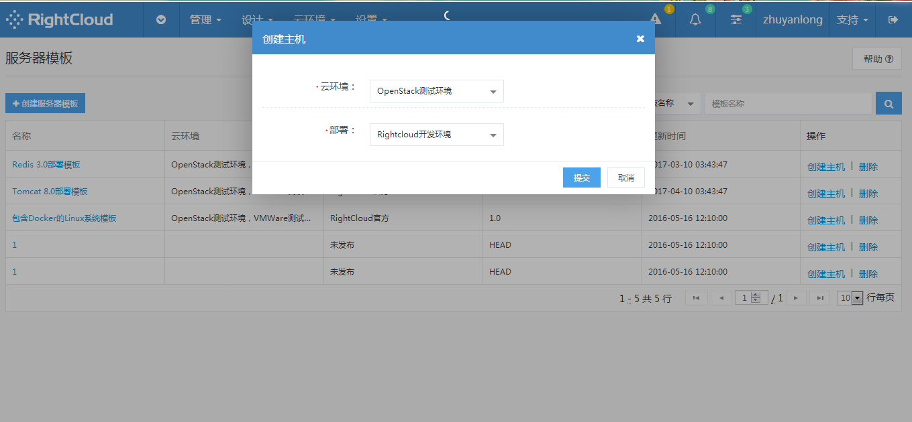
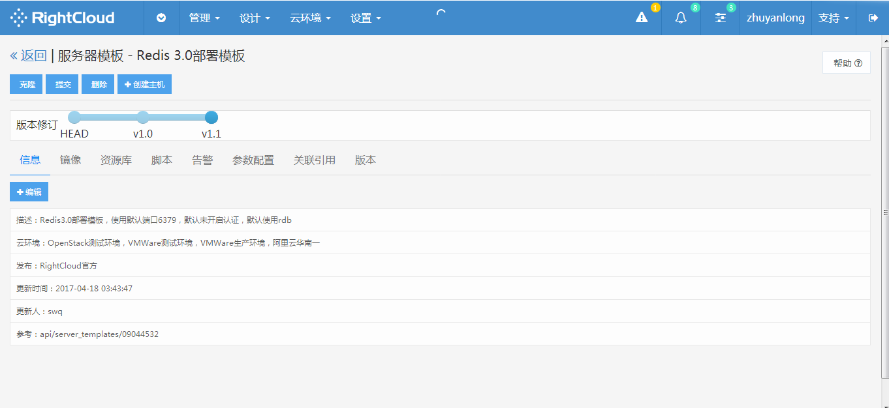

设计

## **脚本管理** ##

- 创建脚本

在顶部导航栏设计菜单下选择脚本管理，进入脚本管理页，点击左上角创建脚本按钮，在弹出页面输入所创建脚本的信息，点击保存。

</img>

- 编辑脚本

在顶部导航栏设计菜单下选择脚本管理，进入脚本管理页，在脚本列表右端操作列，点击编辑，即可对指定脚本进行编辑。

</img>

删除脚本

在顶部导航栏设计菜单下选择脚本管理，进入脚本管理页，在脚本列表右端操作列，选择删除，即可删除指定脚本。

</img>
  
## 多云镜像管理 ##

- 新建多云镜像

点击顶部设计菜单进入多云镜像，点击多云镜像页面左上角创建镜像按钮，在跳转页面中填写多云镜像的名称和描述，点击保存完成创建。

</img>

- 编辑镜像信息

点击顶部设计菜单进入多云镜像，在多云镜像列表点击镜像名进入多云镜像详情页面，在该页面您可以查看多云镜像的信息，云环境，关联引用，版本信息，并且可对部分信息进行编辑。

</img>

- 删除多云镜像

点击顶部设计菜单进入多云镜像，在多云镜像列表造作列点击删除即可删除当前选定多云镜像。

</img>

## 服务器模板 ##

- 创建模板

点击顶部设计菜单进入服务器模板，点击左上角创建服务器模板，在弹出页面填写服务器模板信息，完成后点击提交。

</img>

选择创建主机操作，在弹出窗口中选择主机对应云环境和部署，点击提交完成创建。

点击服务器模板列表右端操作列，点击删除对选中主机进行删除

</img>

- 编辑模板信息

点击顶部设计菜单进入服务器模板，点击模板名称进入模板详情页。即可查看模板的基本信息，镜像信息，资源库，脚本，告警，参数配置，关联引用，版本等信息。

</img>

- 删除模板

点击顶部设计菜单进入服务器模板，点击服务器模板列表右端操作列，选择删除，即可删除当前选中模板。