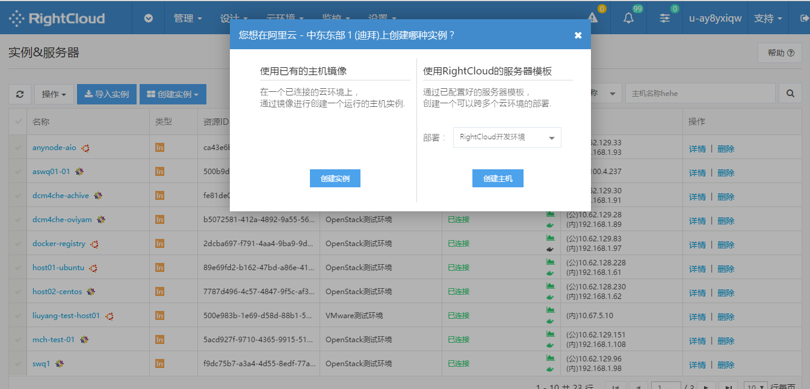

# 
管理
 #

部署组是一组服务器的组合，支持部署的创建，修改，运行，停止，删除，克隆等操作；
提供对部署中的主机进行添加删除，运行，开机，关机等操作；
支持对部署的基本信息，主机监控信息，运行脚本信息，存储卷信息，告警信息，审计日志，历史信息，变更记录查询等功能。

## - 部署组管理 ##

创建部署

点击顶部导航管理，在下拉菜单中选择部署组，进入部署组管理页面，点击左上角创建部署，在弹出窗口中填写部署名称与描述，点击保存后便可在部署列表查看到您新建的部署。
</img>

在部署列表中点击部署名称进入部署编辑页面，点击左上角添加服务器按钮，在弹出窗口中选择部署主机所属云环境，完成后点击进入下一步，填写所添加服务器的详细信息。
</img>

</img>

点击服务器选项卡，进入服务器列表页，然后点击左上角操作下拉菜单，选择您想要进行的服务器操作。
</img>

点击监控选项卡，即可看到选中部署的监控数据。
</img>

点击脚本选项卡进入脚本列表页面，然后点击添加脚本，在弹出窗口中选中您想要添加的脚本，点击底部添加按钮提交。

</img>

选择脚本/Playbook

</img>

点击磁盘选项卡进入磁盘信息页面，即可查看磁盘信息。
</img>

点击默认值选项卡进入部署默认值信息页面，点击左上角编辑按钮，即可对部署默认值进行修改，完成后点击保存提交。

</img>

点击历史选项卡即可查看创建主机的历史记录以及每一个被创建主机的状态与释放时间。
</img>

点击变更选项卡即可查看历史变更记录列表。
</img>

- 修改部署详情

在部署列表中点击部署名称进入部署编辑页面，点击信息导航下编辑按钮，修改部署详情，完成后点击保存。

</img>

- 删除部署

点击顶部导航管理，在下拉菜单中选择部署组，进入部署组管理页面，在部署列表操作列下点击删除。

</img>

</img>

- 克隆部署

在部署列表点击部署名称进入部署编辑页面，点击克隆部署按钮克隆。

</img>

## 实例与服务器 ##

支持Vmware、OpenStack、阿里云、腾讯云等各环境主机实例自动化创建，删除，开机，关机，Tag添加删除等功能；支持根据服务器模板自动化部署应用脚本、配置告警策略。
支持主机基本信息查询，容器管理，监控信息查询，脚本查询，审计信息查看，卷管理，告警信息，控制台日志查看等功能；
提供非云环境主机导入功能，配置主机登录方式进行接管，如果是物理机可配置IPMI信息，进行带外管理功能

</img>

- 导入实例

点击实例&服务器页面左上方导入实例按钮，进入实例接入环境选择页面，您可以选择接入已有云环境下实例，也可以接入其他云环境下实例，选择完成后，点击进入下一步配置实例信息，配置完成后点击提交，完成导入。

</img>

选择对应云下实例

</img>

填写所选实例信息

</img>

- 创建实例

点击实例&服务器页面左上方创建实例按钮，第一步首先在下拉菜单选择被创建实例的云环境

</img>

第二步在弹出窗口选择您想创建的实例类型，点击创建进入实例信息编辑页面.

</img>

第三步填写实例信息，完成后确认信息无误，提交后即可创建。
选取镜像&配置详情信息。
</img>

</img>

- 实例操作——启动、停止、重启、重新部SSH终端

点击实例&服务器页面左上方操作的下拉菜单，选择您想进行的操作。在实例列表的操作列中，您可以查看实例详细信息或者删除选中实例。

</img>

## 容器 ##
- 集群管理

新建集群

点击顶部导航栏管理选项卡，在下拉菜单中选择容器进入容器管理页面，在集群管理选项卡下点击左上方新建集群按钮即可创建集群。新建过程中第一步首先设置集群基本信息，第二步配置master主机，接着第三步配置节点主机，最后确认信息提交。

</img>

</img>

</img>

</img>

- 镜像管理

上传镜像

点击顶部导航栏管理选项卡，在下拉菜单中选择容器进入容器管理页面，在镜像管理选项卡下点击左上方上传镜像按钮，根据提示信息即可进行上传或下载应用镜像操作。

</img>

查看镜像详情

在容器管理页面，点击镜像管理选项卡，进入镜像管理页面，在页面点击镜像名称即可显示镜像对应的详细信息。

</img>

删除镜像

在容器管理页面，点击镜像管理选项卡，进入镜像管理页面，点击镜像列表有段删除按钮，即可对选中镜像进行删除操作。

- 容器管理

查看活动容器

在容器管理页面，点击容器管理选项卡，选中活动容器镜像标签，即可查询对应的活动容器。

</img>
