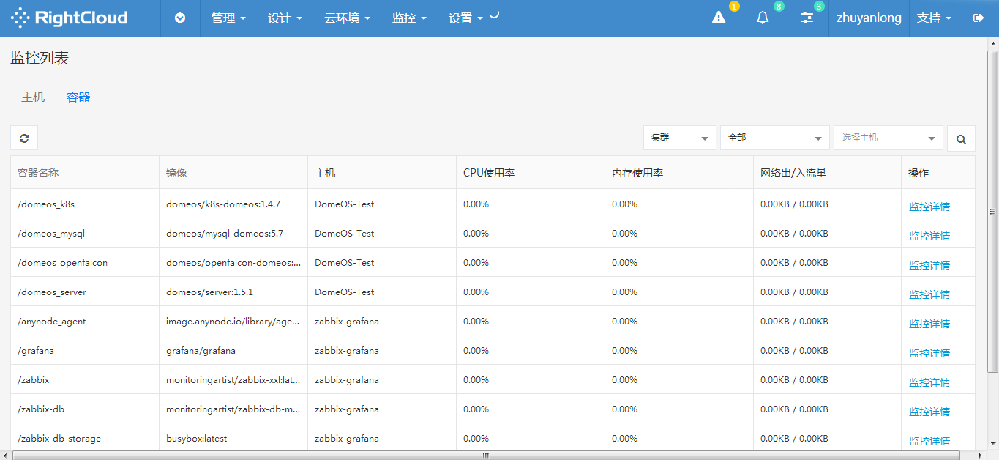
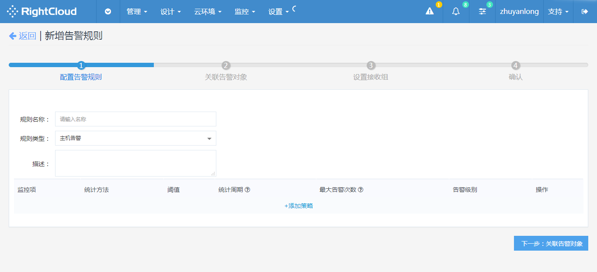
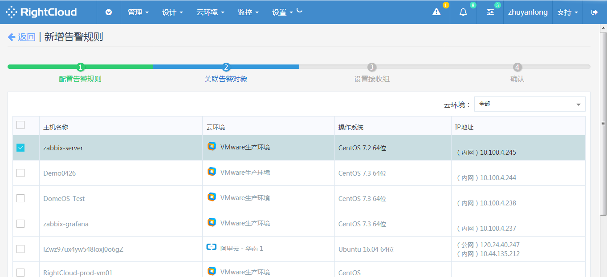
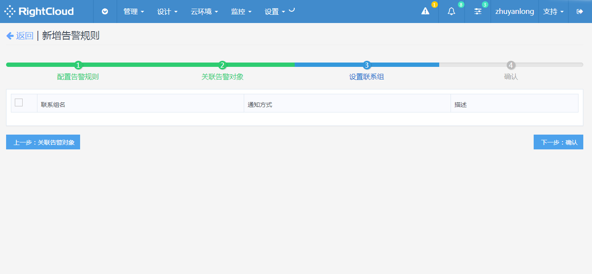
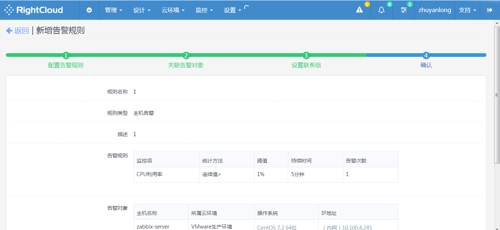
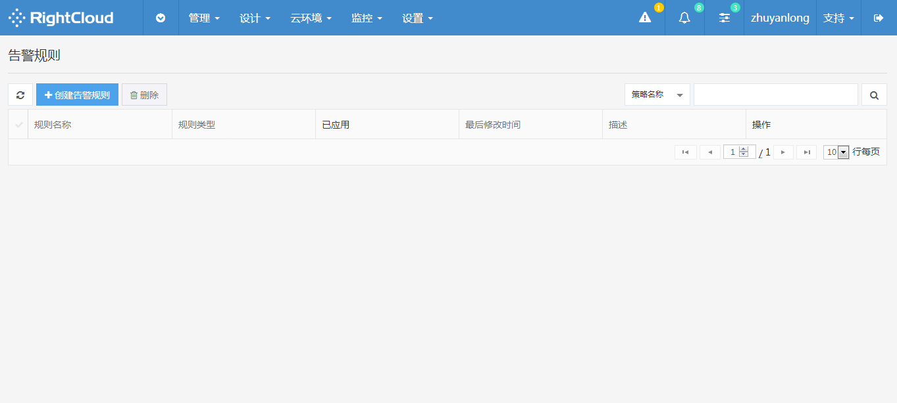
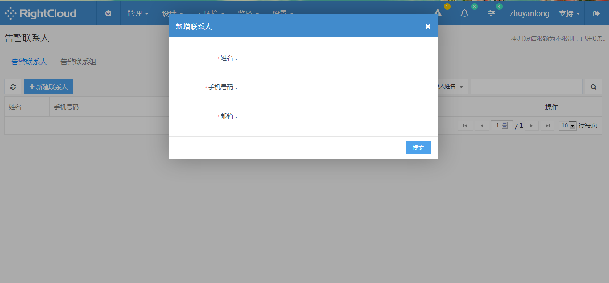
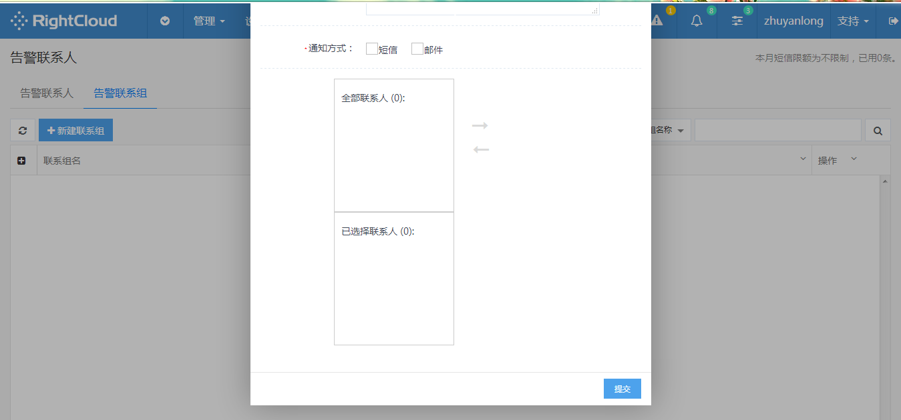

# 
监控
 #

## 仪表盘 ##

点击顶部导航菜单监控并下拉选择仪表盘即可查看仪表盘。

## 监控列表 ##

点击顶部导航菜单监控并下拉选择监控列表，即可分别查看主机监控信息列表和容器监控信息列表。点击列表操作列查看监控详情可查看详细监控信息。

</img>

## 告警列表 ##

点击顶部导航菜单监控并下拉选择告警列表，即可查看所有的告警记录，每条记录显示了告警发生的时间，告警对象，告警内容，告警次数，告警状态等信息，您可以指定条件或者输入关键字查询特定的告警记录。

</img>

- 删除告警记录

您可以通过点击告警列表左上角删除按钮，删除选定的告警信息。

## 告警规则 ##

- 创建告警规则

点击顶部导航栏监控菜单，进入告警规则页面，点击创建告警规则按钮，进入配置告警规则页面，填写完成后点击进入下一步关联告警对象，设置接收组，最后确认信息点击提交，完成规则创建。

</img>

</img>

</img>

</img>

</img>

- 删除告警规则

点击顶部导航栏监控菜单，进入告警规则页面，点击页面左上删除按钮，删除选中规则。

</img>

## 告警联系人/联系组 ##

- 创建联系人/联系组

点击顶部导航监控选项卡选中告警联系人，进入告警联系人管理页面，点击页面左上角新建联系人按钮，填写联系人信息，完成后保存提交，即可将指定联系人添加至告警联系人列表。同时，您也可以建立一个告警联系组，通过点击告警联系组选项卡进入告警联系组列表页，点击左上角新建了联系组，填写联系组信息，然后将指定联系人加入组内，点击提交即可完成创建。

</img>

</img>

