
设置

## 个人设置 ##

- 修改个人信息

点击顶部导航栏设置菜单栏，进入个人设置页面，在个人信息选项卡下可查看您的登录邮箱和手机号码，点击修改手机号可修改您的手机号码，点击修改邮箱可修改您的登录邮箱。

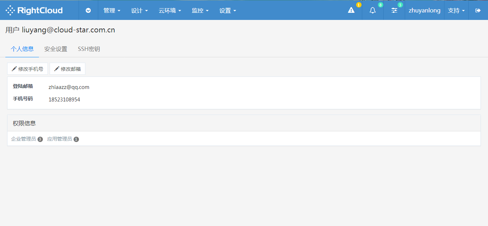</img>

- 修改登录密码

点击顶部导航栏设置菜单栏，进入个人设置页面，在安全设置选项卡下点击修改密码修改登录密码。

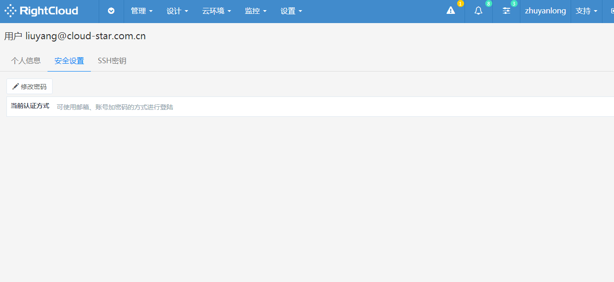</img>

- 导入密钥对

点击顶部导航栏设置菜单栏，进入个人设置页面，在SSH选项卡下点击导入密钥对，在弹出窗口填写密钥对信息，点击提交导入。

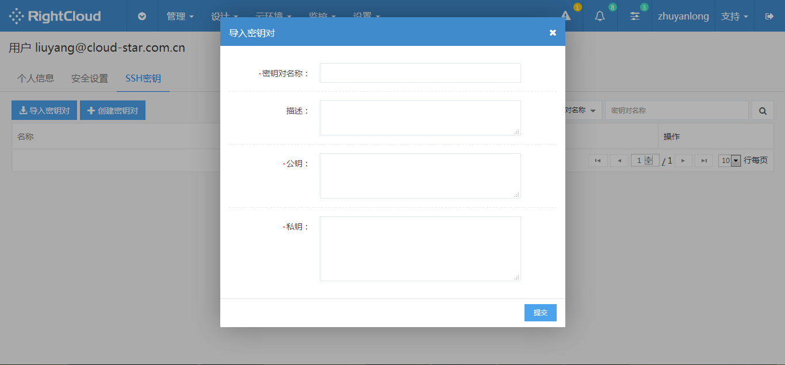</img>

- 创建密钥对

点击顶部导航栏设置菜单栏，进入个人设置页面，在SSH选项卡下点击创建密钥对，在弹出窗口填写密钥对名称和描述，保存后提交。

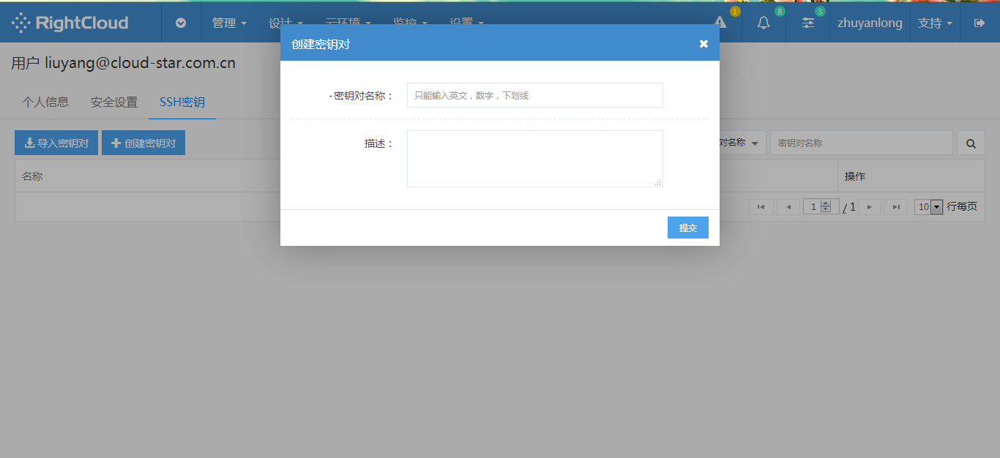</img>

## 项目设置 ##

- 关联云环境配额

点击顶部导航栏设置菜单栏，进入企业设置页面，在项目管理选项卡点击关联云环境按钮在弹出窗口中点击配额操作。

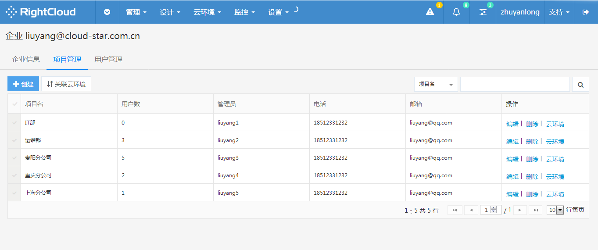</img>

- 修改项目信息

点击顶部导航栏设置菜单栏，进入项目设置页面，便可以对项目的基本信息，默认值配置，API授权等信息进行查看和修改。

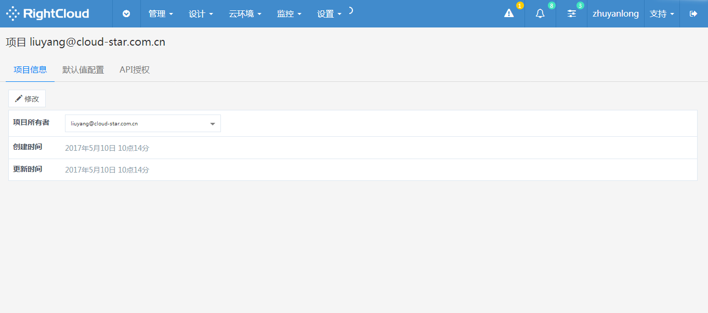</img>

## 企业设置 ##

- 修改企业信息

点击顶部导航栏设置菜单栏，进入企业设置页面，在企业信息选项卡下点击修改进行企业信息修改。

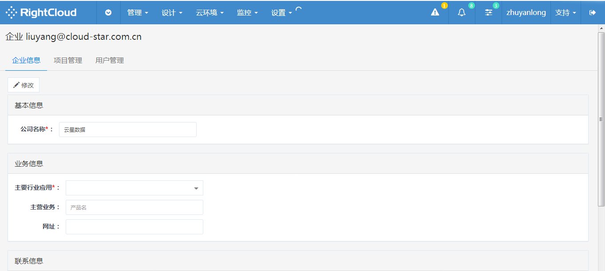</img>

创建项目

点击顶部导航栏设置菜单栏，进入企业设置页面，在项目管理选项卡点击创建按钮创建一个新的项目。

</img>

在用户管理选项卡下点击创建新用户并为其分配角色。

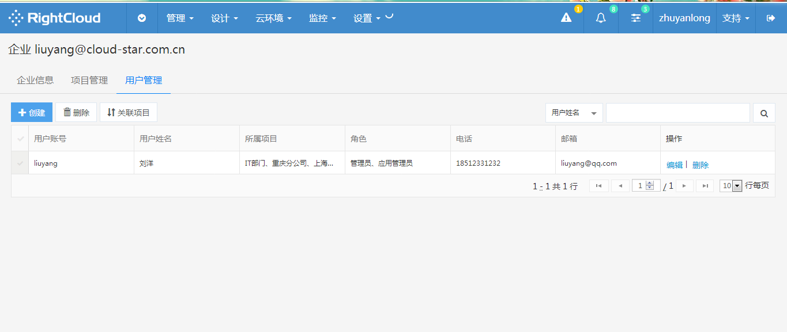</img>

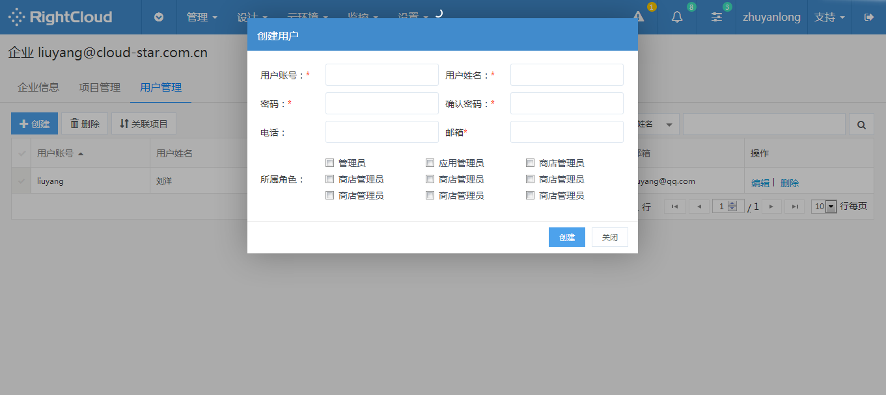</img>

在用户管理选项卡下点击顶部删除按钮删除选中用户。

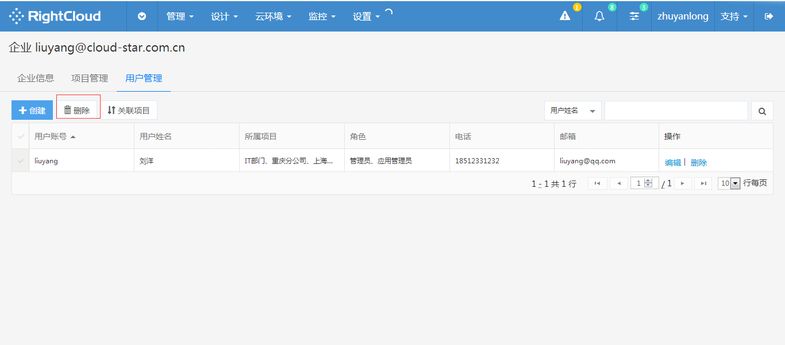</img>

在用户管理选项卡下点击顶部关联项目按钮为当前选中用户关联项目。

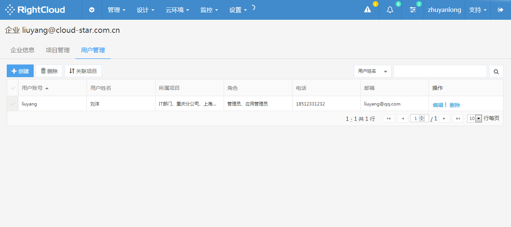</img>
