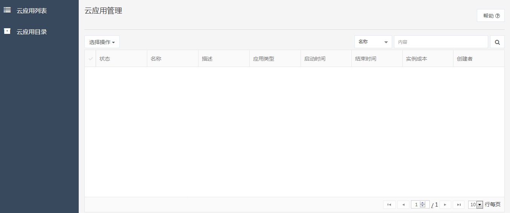
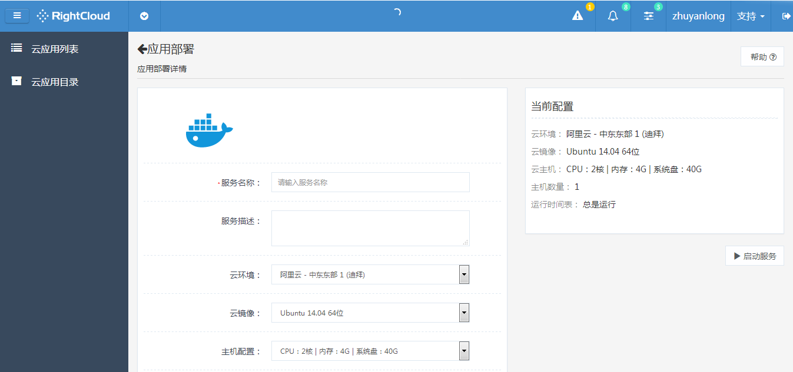

# 
云应用管理
 #

- 云应用列表

点击顶部导航栏最右侧下拉按钮，选择云应用可以查看云应用信息列表，您可以对此列表选中项进行操作，同时可按照指定条件或关键字查询列表内容。

</img>

- 云应用目录

点击顶部导航栏最右侧下拉按钮，选择云应用后点击云应用目录选项卡，您可以查看云应用目录列表，在该列表下您可以搜索指定云应用并查看应用详情，对于每一个云应用，您可以查看应用详情，也可以直接点击运行按钮启动它，您也可以通过点击删除按钮删除不需要的云应用。

</img>

- 云应用部署

您可以通过点击云应用目录中指定云应用进入云应用部署页面对应用进行部署。

</img>